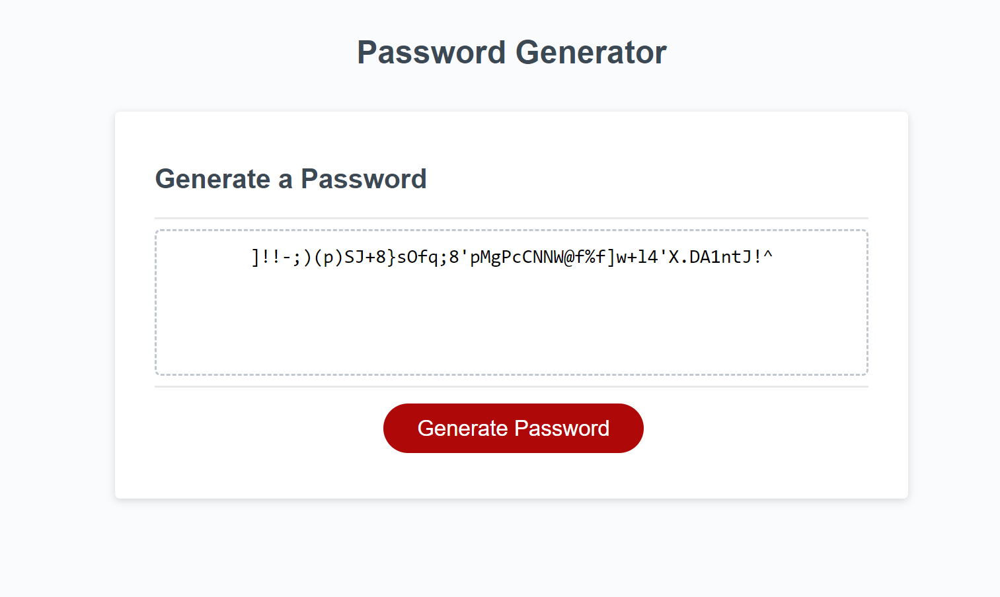
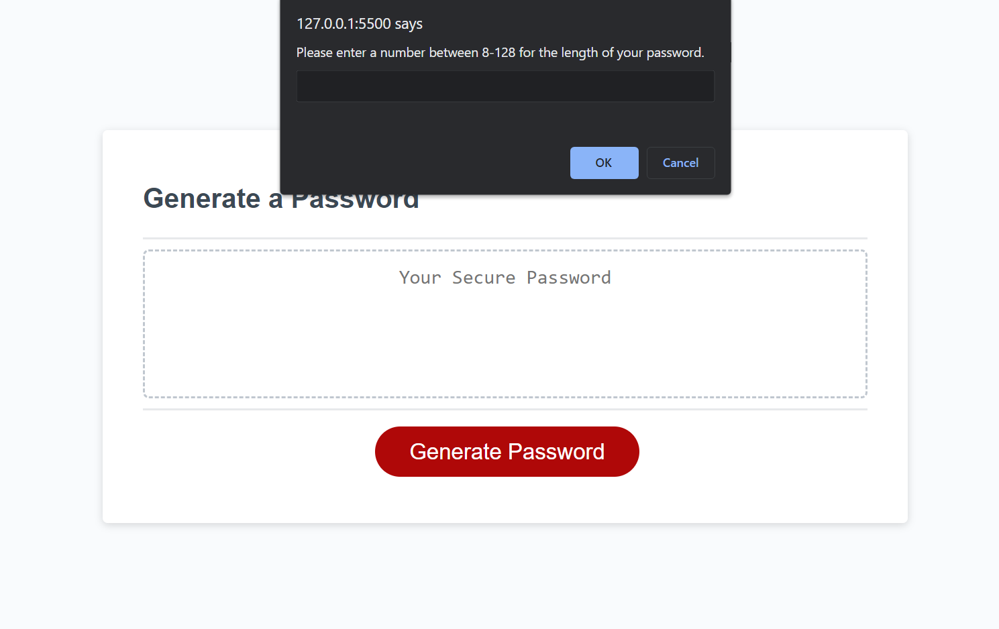
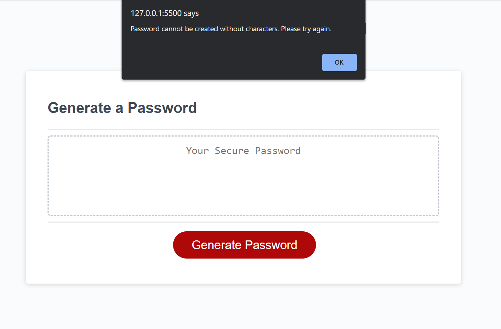

# Week-3-Random-Password

## Description
Displaying my ability to create a random password generator by manipulating Javascript During this challenge, I demonstrated my ability to create variables to hold values, use while loop to constantly repeat until the user provides a satisfactory answer, IFs and ELSE to prompt the user with dialog boxes that have requirements for their password, using CONFIRM, PROMPT, and ALERT, and the usage of a FOR Loop to randomly choose one of the characters in the password and rounds that number into a whole number then returns that character's index.

## Usage
This screenshot shows the deployed website which shows a 50 character randomly generated password including numbers, letters, symbols, and upper and lowercase letters.

## Credits
https://www.w3schools.com/ ||
https://stackoverflow.com/

Cody Thompson: https://github.com/codyleight ||
Bijan Olfati: https://github.com/bolfati

## License
MIT License

Copyright (c) [2023] [Jason Mason]

Permission is hereby granted, free of charge, to any person obtaining a copy of this software and associated documentation files (the "Software"), to deal in the Software without restriction, including without limitation the rights to use, copy, modify, merge, publish, distribute, sublicense, and/or sell copies of the Software, and to permit persons to whom the Software is furnished to do so, subject to the following conditions:

The above copyright notice and this permission notice shall be included in all copies or substantial portions of the Software.

THE SOFTWARE IS PROVIDED "AS IS", WITHOUT WARRANTY OF ANY KIND, EXPRESS OR IMPLIED, INCLUDING BUT NOT LIMITED TO THE WARRANTIES OF MERCHANTABILITY, FITNESS FOR A PARTICULAR PURPOSE AND NONINFRINGEMENT. IN NO EVENT SHALL THE AUTHORS OR COPYRIGHT HOLDERS BE LIABLE FOR ANY CLAIM, DAMAGES OR OTHER LIABILITY, WHETHER IN AN ACTION OF CONTRACT, TORT OR OTHERWISE, ARISING FROM, OUT OF OR IN CONNECTION WITH THE SOFTWARE OR THE USE OR OTHER DEALINGS IN THE SOFTWARE.